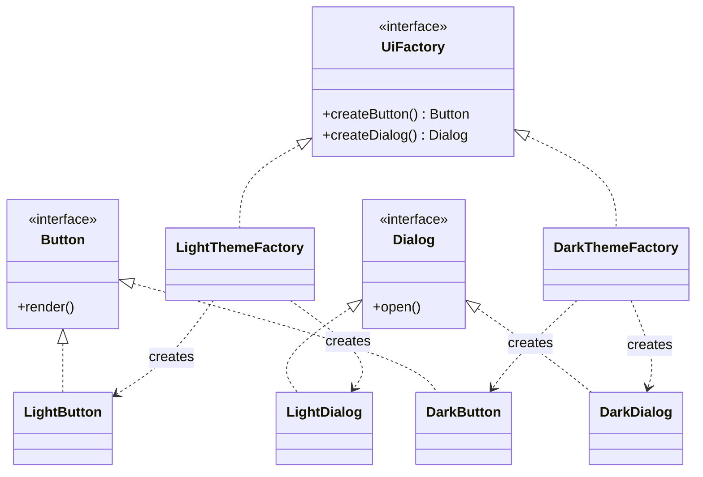

# Abstract Factory - simpelt eksempel

Dette eksempel viser Abstract Factory pattern med to produktfamilier:

- Light theme
- Dark theme

## Roller

- `UiFactory`: abstract factory.
- `LightThemeFactory` og `DarkThemeFactory`: konkrete factories.
- `Button` og `Dialog`: abstrakte produkter.
- `LightButton`, `LightDialog`, `DarkButton`, `DarkDialog`: konkrete produkter.
- `Main`: klientkode der kun arbejder med abstraktioner.

## Klassediagram (Mermaid)

