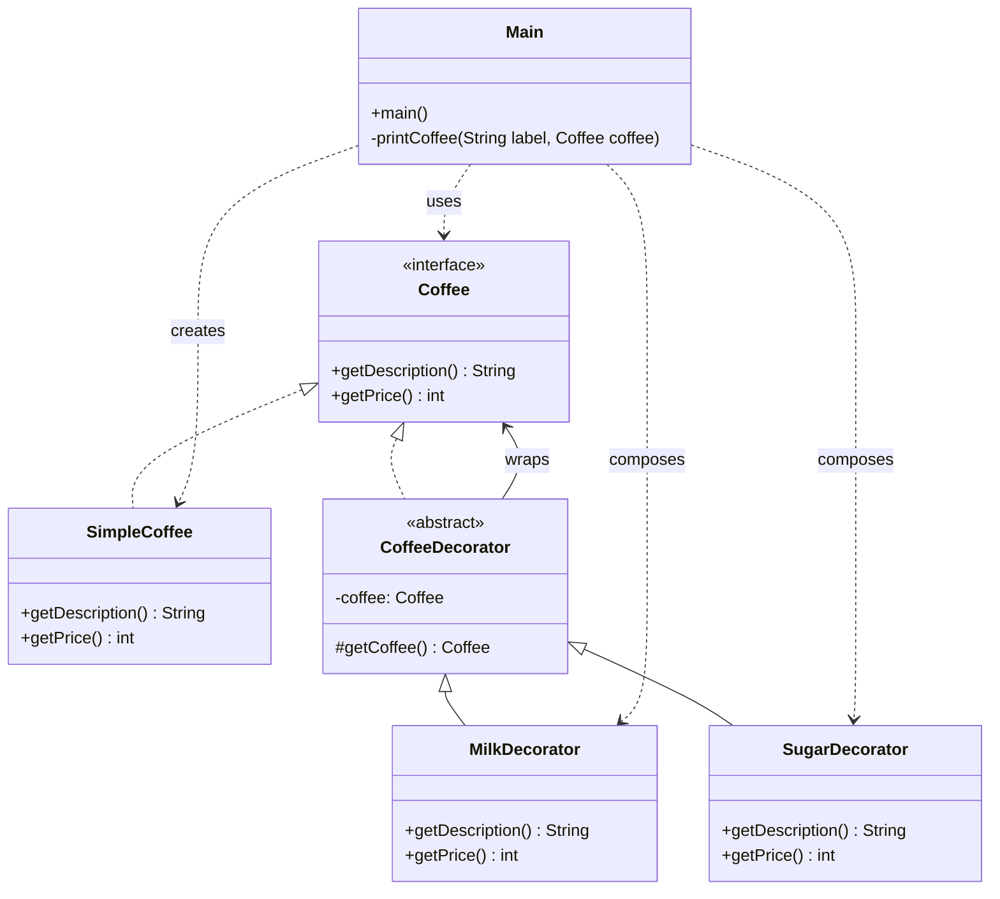

# Decorator - simpelt eksempel

Dette eksempel viser Decorator pattern med `Coffee` som component.

Rollerne er nu fordelt pa separate filer i `examples.decoratorpatter` for at gore strukturen tydeligere.

- `Coffee`: component-interface.
- `SimpleCoffee`: concrete component.
- `CoffeeDecorator`: abstrakt decorator.
- `MilkDecorator` og `SugarDecorator`: konkrete decorators.
- `Main`: klientkode der kombinerer decorators dynamisk.

## Hvorfor bruge Decorator?

Decorator gør det muligt at tilføje ny funktionalitet til et objekt uden at ændre den oprindelige klasse.
I eksemplet kan vi tilføje mælk og sukker til kaffe ved at pakke objektet ind i decorators.

## Klassediagram (Mermaid)



## Kør

```powershell
javac -d out src\examples\decoratorpatter\*.java
java -cp out examples.decoratorpatter.Main
```
