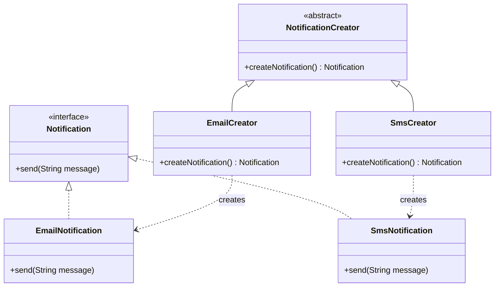

# Factory Method - simpelt eksempel

Dette eksempel viser Factory Method pattern med `Notification` som produkt.

- `Notification`: interface for produkter.
- `EmailNotification` og `SmsNotification`: konkrete produkter.
- `NotificationCreator`: abstrakt creator med factory method `createNotification()`.
- `EmailCreator` og `SmsCreator`: konkrete creators.
- `Main`: klientkode der bruger creator-typen uden at kende konkret produktklasse.

## Klassediagram (Mermaid)

